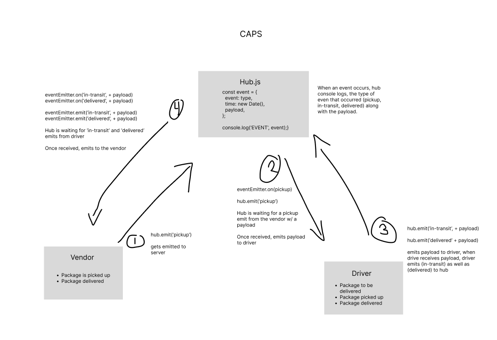
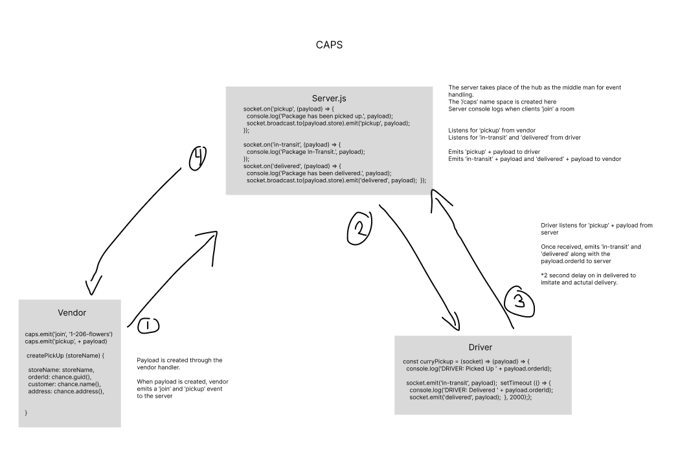

# CAPS

LAB: Event Driven Applications

```text
An event driven application that "distributes" the responsibility for logging to separate modules, using only events to trigger logging based on activity.
```

## Installation

```text
npm install
```

## Usage

```text

Test using:

npm test
```

## UML Diagram




## Deployed Link

> Render Deployment

* [https://caps-otpz.onrender.com](https://caps-otpz.onrender.com)

## Pull Request Link

 
 
